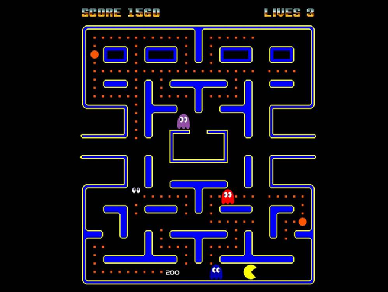

# Cahier des charges
## Présentation générale 
**L’objectif est de construire une version du jeu Pacman.** 
Le héros doit manger toutes les
pacgommes du labyrinthe sans se faire attraper par un des quatre fantômes.  

_Le labyrinthe_  
## Spécifications du jeu Labyrinthe : 
• La configuration du labyrinthe sera celle ci-dessus. Cependant, le chemin qui permet de passer d’un bord à l’autre est
optionnel.

### Fantôme

• Si un fantôme touche Pacman, ce-dernier perd une vie.

• Si un fantôme est mangé par Super-Pacman il est inactif pendant 30 cycles: il (seulement ses yeux) continue à se
déplacer mais ne peut pas manger Pacman.

• Le déplacement des fantômes est aléatoire: à chaque intersection, une direction au hasard sera choisie.
Pacgomme

• Chaque pacgomme peut se transformer en super-pacgomme avec une probabilité de transformation de 0.0001. Elle
restera super-pacgomme pendant 30 cycles puis redeviendra une pacgomme classique si elle n’a pas été mangée.

• Si Pacman mange une super-pacgomme, il devient invincible pendant 30 cycles et peut manger les fantômes.

• Pacman ne peut pas manger plus de quatre super-pacgommes par partie.
Pacman

• La partie est gagnée quand Pacman a mangé toutes les pacgommes.

• Pacman possède 3 vies au début de la partie.

• S’il est mangé, Pacman réapparaît à une position aléatoire.

• Pacman gagne:– 5 points par pacgomme,– 10 points par super-pacgomme,– 20 points par fantôme.

• Les vies restantes et le score seront affichés au-dessus ou en dessous du labyrinthe.

## Optionnel

• Le chemin qui permet de passer d’un bord à l’autre du labyrinthe est optionnel.

• Unstockage des meilleurs scores dans un fichier csv peut être implémenté.

• Réaliser une bande sonore.

• Réaliser une intelligence articifielle pour le déplacement des fantômes qui les incitera à se déplacer préférentiellement
vers Pacman.

## Spécification techniques
• La programmation orientée objet devra être utilisée.

• La configuration du labyrinthe sera initialement stockée dans un fichier csv et importée dans le programme.

• La bibliothèque graphique sera Pyxel. Un cycle du jeu correspond donc à la valeur fps choisie.